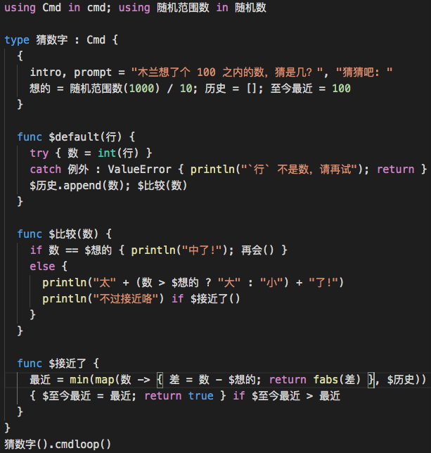
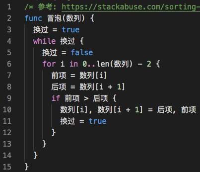

# 木兰编程语言

代码基本语法高亮（部分词法）

运行木兰代码请安装 `pip install ulang`，使用方法见[木兰重现项目首页](https://gitee.com/MulanRevive/mulan-rework)。

## 参考

- [TextMate Language Grammars](https://macromates.com/manual/en/language_grammars)
