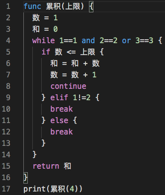

# 木兰编程语言

代码基本语法高亮（部分词法）

更多示例请见基于原 exe 的[用户手册](https://github.com/MulanRevive/bounty/tree/master/%E5%A4%8D%E7%8E%B0%E6%96%87%E6%A1%A3/%E7%94%A8%E6%88%B7%E6%89%8B%E5%86%8C)编写过程中积累的[测试用例](https://github.com/MulanRevive/bounty/blob/master/%E6%B5%8B%E8%AF%95%E4%BB%A3%E7%A0%81/%E6%B5%8B%E8%AF%95.py), 与[原型搭建](https://github.com/MulanRevive/prototype)过程中积累至今的[测试](https://github.com/MulanRevive/prototype/blob/master/%E6%B5%8B%E8%AF%95.py)

运行代码请安装`pip install mulang`，PyPI 发布[在此](https://pypi.org/project/mulang/)。

## Features

Describe specific features of your extension including screenshots of your extension in action. Image paths are relative to this README file.

For example if there is an image subfolder under your extension project workspace:

\!\[feature X\]\(images/feature-x.png\)

> Tip: Many popular extensions utilize animations. This is an excellent way to show off your extension! We recommend short, focused animations that are easy to follow.

## Requirements

If you have any requirements or dependencies, add a section describing those and how to install and configure them.

## Extension Settings

Include if your extension adds any VS Code settings through the `contributes.configuration` extension point.

For example:

This extension contributes the following settings:

* `myExtension.enable`: enable/disable this extension
* `myExtension.thing`: set to `blah` to do something

## Known Issues

Calling out known issues can help limit users opening duplicate issues against your extension.

## Release Notes

Users appreciate release notes as you update your extension.

### 1.0.0

Initial release of ...

### 1.0.1

Fixed issue #.

### 1.1.0

Added features X, Y, and Z.

-----------------------------------------------------------------------------------------------------------

## Working with Markdown

**Note:** You can author your README using Visual Studio Code.  Here are some useful editor keyboard shortcuts:

* Split the editor (`Cmd+\` on OSX or `Ctrl+\` on Windows and Linux)
* Toggle preview (`Shift+CMD+V` on OSX or `Shift+Ctrl+V` on Windows and Linux)
* Press `Ctrl+Space` (Windows, Linux) or `Cmd+Space` (OSX) to see a list of Markdown snippets

### For more information

* [Visual Studio Code's Markdown Support](http://code.visualstudio.com/docs/languages/markdown)
* [Markdown Syntax Reference](https://help.github.com/articles/markdown-basics/)

**Enjoy!**